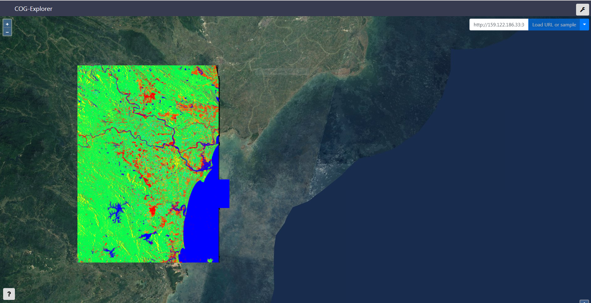

# COG
[](https://bluemix.net)


## What is COG

COG is a RESTful Web API for ingesting normal GeoTIFFs, converting to [Cloud Optimized GeoTIFF (COG)](http://www.cogeo.org/) and finally publishing them into a [Minio](https://www.minio.io/)
bucket in order to serving out of the box from a generic and open source object storage server.

[](http://www.cogeo.org)

The server has been developed in Django and has embedded [COG-Explorer](https://github.com/geotiffjs/cog-explorer/) a COG viewer built with [OpenLayers](http://openlayers.org/), [geotiff.js](https://geotiffjs.github.io/) and [React](https://reactjs.org/).

### Table of Contents
* [Summary](#summary)
* [How To Use](#howtouse)
* [IBM Cloud Enablement](#enablement)
* [Requirements](#requirements)
* [Configuration](#configuration)
* [Run](#run)
* [Debug](#debug)
* [License](#license)

<a name="summary"></a>
### Summary
The architecture of COG is composed by the following components for web serving
geotiff files out of an object storage bucket once they are converted into the
cloud optimized format:

- *A REST API for COG objects* built with [**Django Rest Framework**](https://www.django-rest-framework.org/)
- *A database for objects information* built with [**PostgreSQL]()
- *A web mapping viewer for COGs* built with [**React**](https://reactjs.org/) and [**OpenLayers**](http://openlayers.org/)
- *A bucket storage server for COGs* built with [**Minio**](https://www.minio.io/)

<a name="howtouse"></a>
### How To Use

Allowed actions for now are:

- *View all available COG-ready GeoTIFFs*
- *View a COG-ready GeoTIFF resource*
- *Upload a GeoTIFF and publish it as a COG*
- *Delete a COG-ready GeoTIFF resource*

Assuming you have a normal GeoTIFF image called `my-awesome-image.tif` then you can ingest and exploit
it as described in the following paragraphs.

**Note**: At the moment there are some limitations which are considering a GeoTIFF valid for ingesting as COG only if it has tiled overviews. Please see [here](https://trac.osgeo.org/gdal/wiki/CloudOptimizedGeoTIFF) for further information on the matter.

#### Upload a GeoTIFF

The operation needs an authorization header with a Basic Authentication from an administrator

**HTTP POST Request**

```
curl -X POST \
    http://159.122.186.33:30800/api/cogs/ \
    -H 'Authorization: Basic YWRtaW46YWRtaW4=' \
    -H 'Cache-Control: no-cache' \
    -H 'Content-Disposition: attachment; my-awesome-image.tif' \
    -H 'Content-Type: image/tif' \
    -H 'content-type: multipart/form-data; boundary=----WebKitFormBoundary7MA4YWxkTrZu0gW' \
    -F image=@/tmp/CallForCode/my-awesome-image.tif \
    -F name=my-awesome-image.tif \
    -F compression=raw
```

and you might expect such response:

**HTTP Response**

```
HTTP/1.1 201 Created

Allow: GET,POST,HEAD,OPTIONS
Connection: close
Content-Length: 0
Date: Fri, 28 Sep 2018 14:11:07 GMT
Server: gunicorn/19.7.1
Vary: Accept, Cookie, Origin
X-Frame-Options: SAMEORIGIN
```

#### View all GeoTIFFs

**HTTP GET Request**

```
curl -X GET \
    http://159.122.186.33:30800/api/cogs/
```

and you might expect such response:

**HTTP Response**

```json
HTTP/1.1 200 OK

Allow: GET,POST,HEAD,OPTIONS
Connection: close
Content-Length: 1161
Content-Type: application/json
Date: Fri, 28 Sep 2018 14:11:07 GMT
Server: gunicorn/19.7.1
Vary: Accept, Cookie, Origin
X-Frame-Options: SAMEORIGIN

[
    {
        "id": "6ef0612f-4075-4567-beb0-7cacafe1f1c5",
        "name": "Floods-subset-human-out-with-ovr.tif",
        "bucket_name": "cog",
        "resource_uri": "http://159.122.186.33:30900/cog/Floods-subset-human-out-with-ovr.tif",
        "created_at": "2018-09-27T09:48:39.657471",
        "updated_at": "2018-09-27T09:48:39.657500"
    },
    {
        "id": "486db87e-0758-4e1e-9d60-acb25e8402f4",
        "name": "Vietnam-out-with-ovr.tif",
        "bucket_name": "cog",
        "resource_uri": "http://159.122.186.33:30900/cog/Vietnam-out-with-ovr.tif",
        "created_at": "2018-09-27T09:53:57.497591",
        "updated_at": "2018-09-27T09:53:57.497617"
    },
    {
        "id": "ffccd8a3-fba5-4250-bdab-e182d15042f8",
        "name": "subset_0_of_FINAL_S1A_IW2_SLC__1SDV_20180806T110540_20180818T110641-with-ovr.tif",
        "bucket_name": "cog",
        "resource_uri": "http://159.122.186.33:30900/cog/subset_0_of_FINAL_S1A_IW2_SLC__1SDV_20180806T110540_20180818T110641-with-ovr.tif",
        "created_at": "2018-09-27T10:05:19.316314",
        "updated_at": "2018-09-27T10:05:19.316340"
    },
    {
        "id": "0395f50e-28db-423d-a56c-ede0d1c4fb59",
        "name": "my-awesome-image.tif",
        "bucket_name": "cog",
        "resource_uri": "http://159.122.186.33:30900/cog/my-awesome-image.tif",
        "created_at": "2018-09-28T14:11:07.030245",
        "updated_at": "2018-09-28T14:11:07.030271"
    }
]
```

#### View a specific GeoTIFFs

**HTTP GET Request**

```
curl -X GET \
    http://159.122.186.33:30800/api/cogs/486db87e-0758-4e1e-9d60-acb25e8402f4
```

and you might expect such response:

**HTTP Response**

```json
HTTP/1.1 200 OK

Allow: GET,POST,HEAD,OPTIONS
Connection: close
Content-Length: 257
Content-Type: application/json
Date: Fri, 28 Sep 2018 14:11:07 GMT
Server: gunicorn/19.7.1
Vary: Accept, Cookie, Origin
X-Frame-Options: SAMEORIGIN

{
    "id": "486db87e-0758-4e1e-9d60-acb25e8402f4",
    "name": "Vietnam-out-with-ovr.tif",
    "bucket_name": "cog",
    "resource_uri": "http://159.122.186.33:30900/cog/Vietnam-out-with-ovr.tif",
    "created_at": "2018-09-27T09:53:57.497591",
    "updated_at": "2018-09-27T09:53:57.497617"
}
```

#### Delete a specific GeoTIFFs

**HTTP GET Request**

```
curl -X DELETE \
    http://159.122.186.33:30800/api/cogs/486db87e-0758-4e1e-9d60-acb25e8402f4/
```

and you might expect such response:

**HTTP Response**

```json
HTTP/1.1 204 No Content

Allow: GET,POST,HEAD,OPTIONS
Connection: close
Date: Fri, 28 Sep 2018 14:11:07 GMT
Server: gunicorn/19.7.1
Vary: Accept, Cookie, Origin
X-Frame-Options: SAMEORIGIN
```

#### Explore GeoTIFFs from a web mapping viewer

- Open the browser at the following location `/explorer` of your server (i.e. [http://159.122.186.33:30800/explorer](http://159.122.186.33:30800/explorer))
- Copy and paste the `resource_uri` of one returned GeoTIFF
- Click the button `Load URL or sample`



<a name="enablement"></a>
### IBM Cloud Enablement

All the components can be deployed into a Kubernetes cluster either [Minikube](https://kubernetes.io/docs/setup/minikube/) or IBM Cloud instance simply running few `kubectl` commands.

#### Minikube


#### IBM Cloud k8s


<a name="requirements"></a>
### Requirements
#### Local Development Tools Setup (optional)

- If you don't already have it, install [Python](https://www.python.org/downloads/)

#### IBM Cloud development tools setup (optional)

1. Install [IBM Cloud Developer Tools](https://console.bluemix.net/docs/cli/idt/setting_up_idt.html#add-cli) on your machine
2. Install the plugin with: `bx plugin install dev -r bluemix`


#### IBM Cloud DevOps setup (optional)

[](https://console.ng.bluemix.net/devops/setup/deploy/)

[IBM Cloud DevOps](https://www.ibm.com/cloud-computing/bluemix/devops) services provides toolchains as a set of tool integrations that support development, deployment, and operations tasks inside IBM Cloud. The "Create Toolchain" button creates a DevOps toolchain and acts as a single-click deploy to IBM Cloud including provisioning all required services. 

***Note** you must publish your project to [Github](https://github.com/) for this to work.


<a name="configuration"></a>
### Configuration

The project contains IBM Cloud specific files that are used to deploy the application as part of an IBM Cloud DevOps flow. The `.bluemix` directory contains files used to define the IBM Cloud toolchain and pipeline for your application. The `manifest.yml` file specifies the name of your application in IBM Cloud, the timeout value during deployment, and which services to bind to.

Credentials are either taken from the VCAP_SERVICES environment variable if in IBM Cloud, or from a config file if running locally. 


<a name="run"></a>
### Run
#### Using IBM Cloud development CLI
The IBM Cloud development plugin makes it easy to compile and run your application if you do not have all of the tools installed on your computer yet. Your application will be compiled with Docker containers. To compile and run your app, run:

```bash
bx dev build
bx dev run
```


#### Using your local development environment


##### Endpoints

Your application is running at: `http://localhost:3000/` in your browser.

- Health endpoint: `/health`


<a name="debug"></a>
### Debug

#### Using IBM Cloud development CLI
To build and debug your app, run:
```bash
bx dev build --debug
bx dev debug
```
#### Using your local development environment
To debug a `django` project run `python manage.py runserver` with DEBUG set to True in settings.py to start a native django development server. This comes with the Django's stack-trace debugger, which will present runtime failure stack-traces. For more information, see [Django's documentation](https://docs.djangoproject.com/en/2.0/ref/settings/).

<a name="license"></a>
### License

[](https://opensource.org/licenses/Apache-2.0)